In this lab, we will work cover information and exercises related to basic coordination systems. 

## Part 1: Coordination Plane Exercise [LAB] 
### 1.1 Cartesian coordinate system 
In graphics, we will work a lot with [Cartesian coordinate systems.](https://en.wikipedia.org/wiki/Cartesian_coordinate_system) Each point within the coordinate system can be represented by a group of numerical values. 


The coordinate of P can be represented as 
```
{"x":50,"y":50}
```
or, simply 
```
(50,50)

# by convention, the order of the coordinate is alphabetically sorted. e.g., if you have X and Y axis, you write the X-axis value before the Y-axis value. 

```
In programming, we often use variables to hold numerical values and expressions. For example, 
```
m=50
n=2*25

#coordinate of point P
P=(m,n)

```

The direction and orientation of the axis is subject to change. When specifying coordinates, it's always important to check the axis labels and the origin. Coordinates could have negative values.  


```
Task 1.11 TODO: Write the coordinate for point P and point Q. 

P=(     ,      )
Q=(     ,      )
```


```
1.11 TODO: Write the coordinate for point P and point Q. 

P=( n, -m ) # direction of Y is reversed. n and m value is different from the previous annotation 
Q=(  -0.75*n   , m )
```



The coordinate system also works in 3D. Always check the direction, origin, and orientation of all axes. 


```
#Task 1.12 TODO: In the diagram above, write down the coordinates for P0, P1, and P2


P0=(m,0,n )
P1=(    ,      ,      )
P2=(    ,      ,      )
```




```
#TODO: In the diagram above, write down the coordinates for P0, P1, and P2


P0=(m,0,n )
P1=(0,a,b )
P2=(c,d,0)

```



### 1.2 Working with lines and paths 

In this course, we will call the graphical elements that contains two or more points as **`lines`** or `paths`. We use these two terms interchangably. 


```
#Task 1.21 TODO: according to the diagram above, write down the coordinates for LINE that contains P0-P1 and the PATH that contains P0 P1 and P2

line_p0p1=((),())
path_p0p1p2=((),(),())
```

Alternatively, you can specify the coordinates for each point first, then group them together to make lines and paths 

```
#Task 1.22 TODO: according t the diagram above, write down the coordinates for LINE that contains P0-P1 and the PATH that contains P0 P1 and P2

p0=(,)
p1=(,)
p2=(,)

line_p0p1=(p0,p1)
path_p0p1p2=(p0,p1,p2)

```


```
#TODO: In the diagram above, write down the coordinates for LINE that contains P0-P1 and the PATH that contains P0 P1 and P2

line_p0p1=((-a,-b),(n,m))
path_p0p1p2=((-a,-b),(n,m),(d,-c))

OR 

p0=(-a,-b)
p1=(n,m)
p2=(d,-c)

line_p0p1=(p0,p1)
path_p0p1p2=(p0,p1,p2)

```



All geometries we work with in this class can be specified as `paths`. For instance, various polygons, simple 3D geometries like cubes and prisms.  


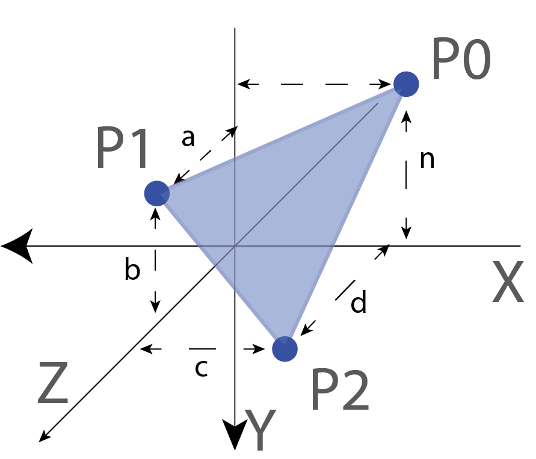


In the example above, point P0, P1 and P2 form a 3D path. If this path is closed, it is basically a plane in the 3D space. 

```
#Task 1.23 TODO: according to the diagram above, write down the coordinates for PATH that contains P0 P1 and P2
# pay attention to the axis labels 

path_p0p1p2=((),(),())

```



```
#TODO: according to the diagram above, write down the coordinates for PATH that contains P0 P1 and P2
# pay attention to the axis labels 

p0=(-m,-n,0)
p1=(0,-b,a)
p2=(-c,0,d)
path_p0p1p2=(p0,p1,p2)

```



### 1.3 Working with PILLOW  
We will learn a powerful python-based imaging package called [PILLOW](https://python-pillow.org/) (often called **PIL**).  For the rest of the semester, we will primarily create designs using the PIL package.   


  [(partially covered in video)](https://youtu.be/2ksVUqvOUCY)



  
#### 1.31 Creating and saving images using PIL
  
To use the PIL package, you need to import the PIL module. Because the PIL module has multiple submodules, we will only import parts that are relevant to us.   
  
  
Create a python script, called `hw1_lab.py`, write the following import statement.
  
```  
from PIL import Image, ImageDraw  
```  
  
- If you have installed Anaconda, PIL is likely to be installed along with your anaconda.   
- If you have not installed PIL, please follow [this installation guide](https://pillow.readthedocs.io/en/stable/installation.html)  
  
  
There are multiple ways to create images using the PIL package. We will use the `Image.new()` method ([doc](https://pillow.readthedocs.io/en/stable/reference/Image.html#PIL.Image.new)).  
  
The PIL.Image.new() method takes 3 values: **mode, size, and color.**   
  
`mode` indicates the type of image you are generating. According to the [documentation](https://pillow.readthedocs.io/en/stable/handbook/concepts.html#concept-modes):  
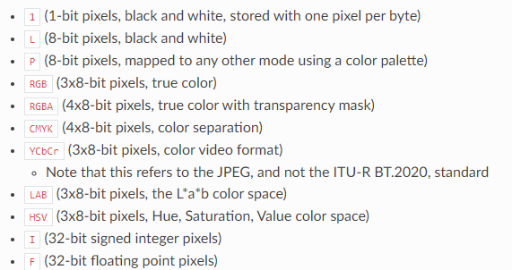  
  
The most relevant modes we will use in this class includes:  
- 1: black and white images:  
   -  you only have two color values: 0 is black, 1 is white.   
- L: grayscale images:  
   - you have the full 256 grayscale intensities. 0 is the darkest, 1 is the lightest     
- RGB: colored image with RGB value   
- HSV: a colored image that uses Hue, Saturation, and Value.   
  
`size` is a 2-tuple that contains the width and height of the image in pixels.   
e.g.,   
```  
  
width=300  
height=300  
size=(width,height)  
  
```  
  
`color` is the default color to use for the image. By default, the image is black.   
 
 
To show an image, use the `PIL.Image.show()` command.   
  
e.g.,   
```  

#Run the following script with command line / terminal 

from PIL import Image,ImageDraw    
    
    
width=300
height=300
size=(width,height)    
    
img=Image.new("L",size,0) #store the created image into a variable called img

img.show() #show this image with your system's image viewer. 

```  
  
To save an image, use `Image.save()` method:   
  
Image library provides powerful image exporting utilities. [Read to the documentation here](https://pillow.readthedocs.io/en/stable/reference/Image.html#PIL.Image.new) to learn more about the `Image.save()` method.  [This document](https://pillow.readthedocs.io/en/stable/handbook/image-file-formats.html) lists all the possible export options.   
  
In summary, you save an image by calling:  
  
  
```  
#img is a variable that holds your image #save_addr is a variable that holds the location and name of your output #e.g., save_addr="c:/test/test_img.png"  
# if save_addr only contains image name, e.g., save_addr="test.jpg", # then your image will be stored in the same location of your python script.   
  
img.save(save_addr)  
```


#####  Task 1.31: Create a 600 by 600 image with a white background, save it in your folder as "600_sq_test.png"
```
# TODO

```

#### Draw any path with Pillow 

Before we proceed with any drawings, we want to make sure we understand the coordinate system that we are working with. PIL (and many other 2D graphics systems) uses a coordinate system that: 
1. The top left corner of the canvas (or screen) is the origin. 
2. The positive direction of the X axis is pointing towards the right.  
3. The positive direction of the Y axis is pointing downwards. 

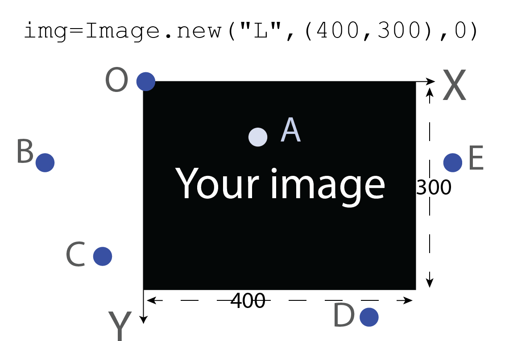

On the image above, the black area is what you are creating with the code `Image.new("L",(400,300),0)`. The top left corner of the image is `(0,0)`.

Points that do not have positive X and Y values are not visible. i.e., in the example above, point A and point O are in the visible area, whereas point B, C, D, E are not visible. 


In PIL, the `ImageDraw` module provides drawing utilities to create graphics. To create a rectangle, you have multiple options:  
1. You can use `ImageDraw.line()` to create 4 lines [doc here](https://pillow.readthedocs.io/en/stable/reference/ImageDraw.html#PIL.ImageDraw.ImageDraw.line).   
2. Or `ImageDraw.polygon()` [doc](https://pillow.readthedocs.io/en/stable/reference/ImageDraw.html#PIL.ImageDraw.ImageDraw.polygon)  

To create a drawing, you need to have a canvas (i.e., an image)
```
from PIL import Image,ImageDraw    
    
    
width=400
height=300
size=(width,height)    
    
img=Image.new("L",size,0)

```

After creating the image (currently stored in the variable `img`), we want to create an `ImageDraw.Draw` object. At this moment, you can think of this object as the brush that is paired with the canvas. All the geometries that you want to put on the canvas will have to go through this brush. 

```
#(cont. from previous block)

draw=ImageDraw.Draw(img) #this is the draw object

```

To draw a line, you will need the coordinates of the line.
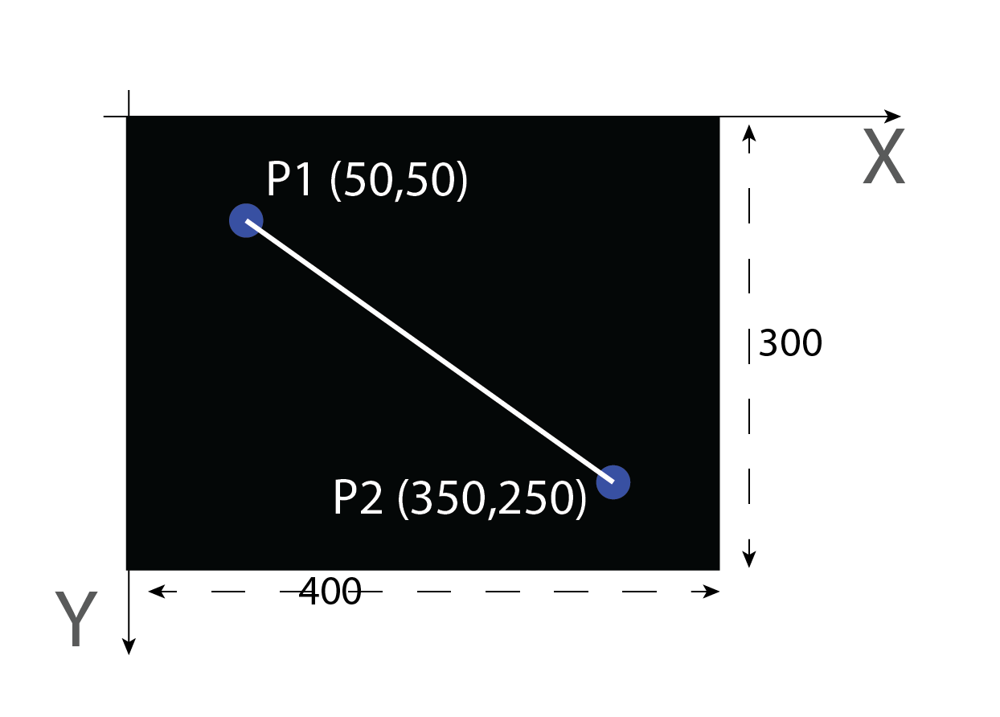

```
#(cont. from previous block)
line=[(50,50),(350,250)] #specify the coordinate of the line
draw.line(line,fill=255,width=3) # because we created a grayscale image, the fill (color of the line) is an integer value between 0 and 256. 0 is black and 255 is white. 
# The unit of the  width is in pixel.   
```


Putting it all together, to replicate the image above, you will need the following block of code:
```
from PIL import Image,ImageDraw    
    
    
width=400
height=300
size=(width,height)    
    
img=Image.new("L",size,0)
draw=ImageDraw.Draw(img) #this is the draw object
line=[(50,50),(350,250)] #specify the coordinate of the line
draw.line(line,fill=255,width=3) # because we created a grayscale image, the fill (color of the line) is an integer value between 0 and 256. 0 is black and 255 is white. 

img.show()
# optional: save it using img.save(addr)

```

If everything works out, you will see an image similar to this:

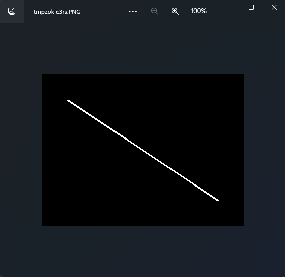

##### Task 1.32: Replicate the following image

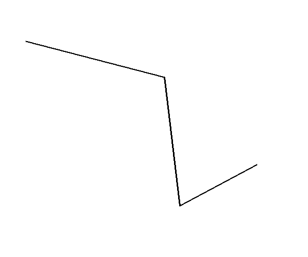
 
using the following specifications 
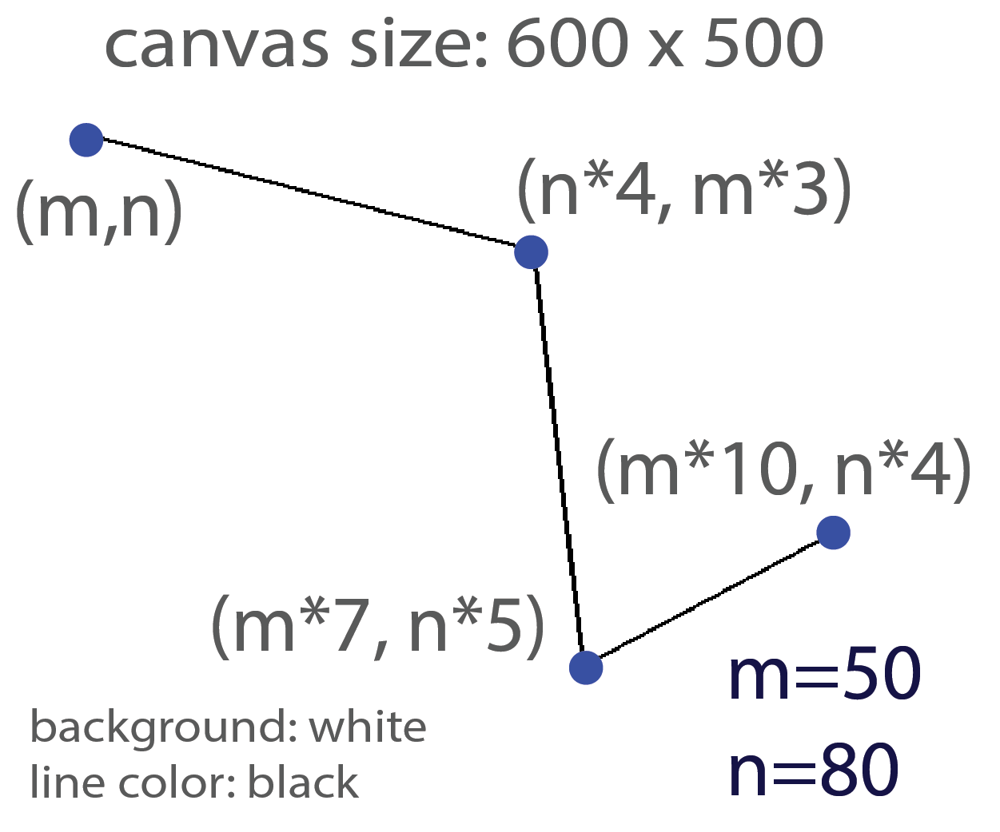

## Part 2: Creating grayscale images with Pillow 

Create a new python script called `hw1.py`. In this file you will replicate 4 images and create 2 images on your own. All canvases are 800 by 800 pixels. Texts and dash lines on the images are for annotation only. You don't have to recreate these annotations. 

### Task 2.1: Replicate image 1


Annotated version:

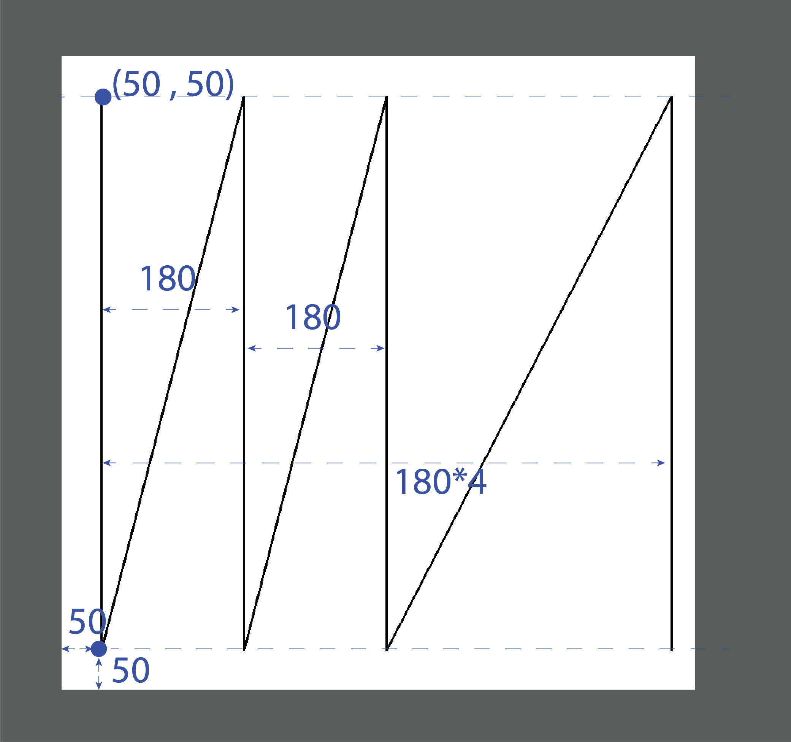


Save this image as `img1.png`. Add it into the answer sheet and paste a screenshot of the code you used to create img1 to the corresponding document.

### Task 2.2: Replicate image 2

Note: don't delete the previous canvas and draw object. Instead, create a new canvas and a new image draw and save them into new variables. 

e.g., if you created img1 and draw1, then create img2 and draw2 for this task. 


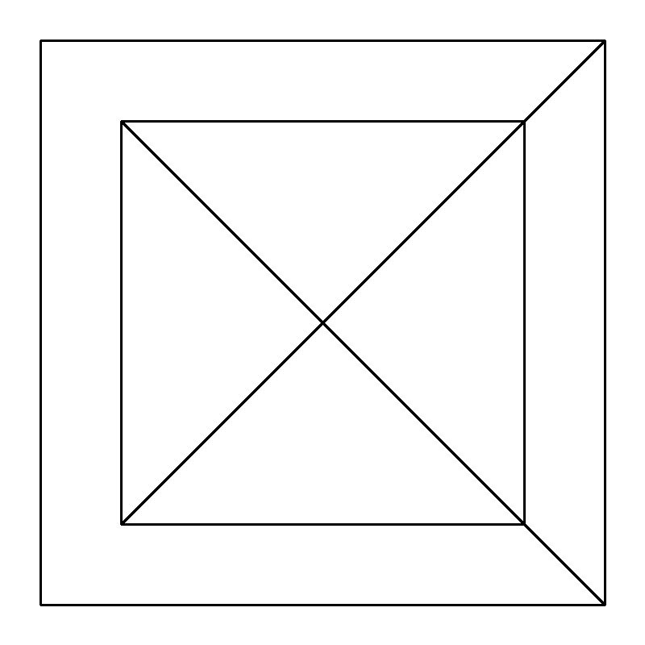

Annotated version:


Fill in the answer sheet. 


### Task 2.3 Replicate image 3 

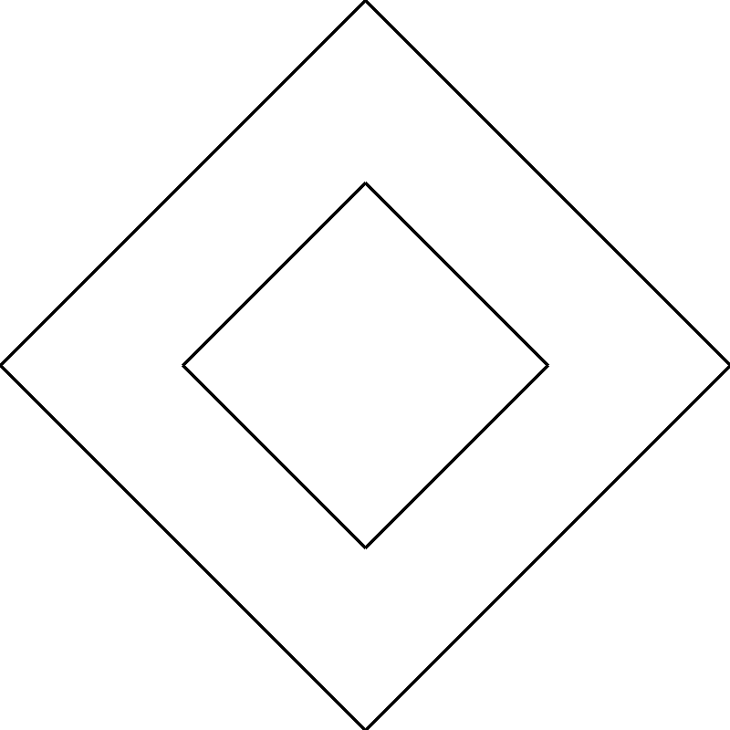

Annotated version:


Fill in the answer sheet. 


### Task 2.4 Replicate image 4 

Read the documentation of `ImageDraw.polygon()` [doc](https://pillow.readthedocs.io/en/stable/reference/ImageDraw.html#PIL.ImageDraw.ImageDraw.polygon). In PIL, polygons are closed shapes that could be filled. In the `ImageDraw.polygon()` method, you can supply a `fill` value and an `outline` value. 

Replicate the following image and fill in the answer sheet. 

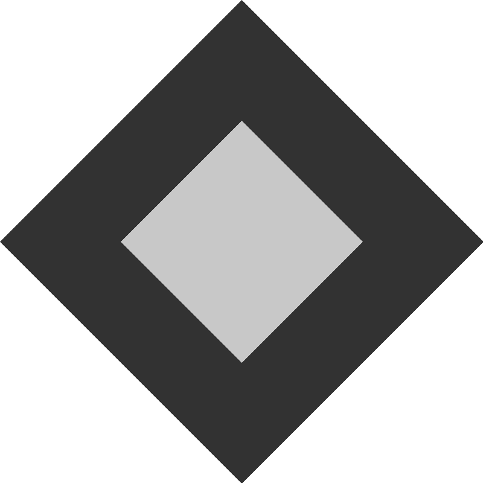

The larger square is filled with the grayscale value of 50. 
The small square is filled with the grayscale value of 200. 

Fill in the answer sheet. 

### Task 2.5 Design your own square drawing. 

Sketch out 10 different designs (on paper, using other software) that satisfy these rules:
1. On a square canvas 
2. Has at least 5 lines. Remember, each line can have more than 2 points.  
3. Has at least 2 polygon (i.e., filled shape)

Pick 2 designs, annotate them to the point where you can clearly get the coordinate of each element in the design. 

Take a photo/screenshot of your sketch, fill in the answer sheet. 


### Task 2.6 Implement your own design

Implement your chosen design with PIL. fill in the answer sheet. 

-------------END OF PART 2---------------------

## Submission Instruction 
Upload the following files to canvas (without compressing/zipping them)
1.hw1_part2.py
2.hw1_answersheet.pdf (you can use File->download-> as PDF to export the pdf version)


