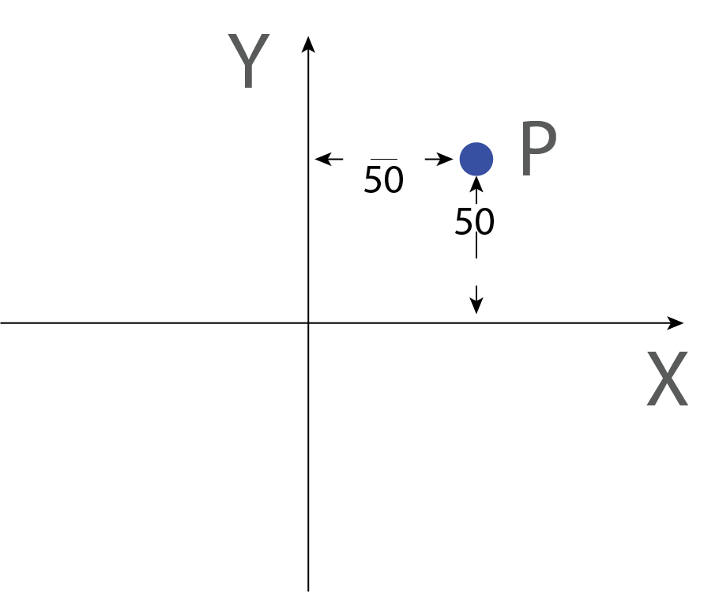
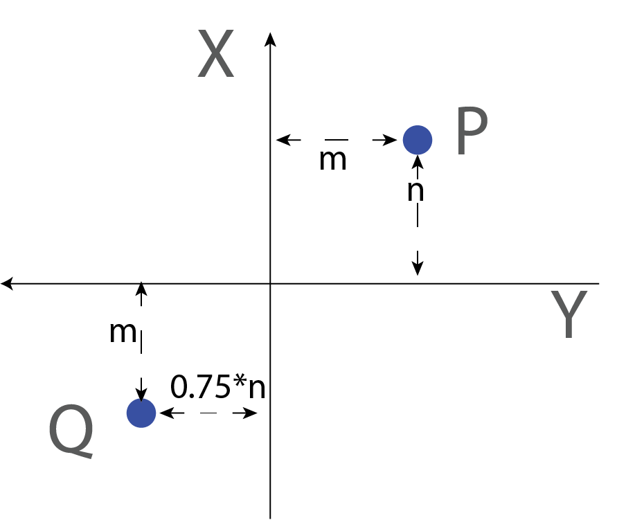
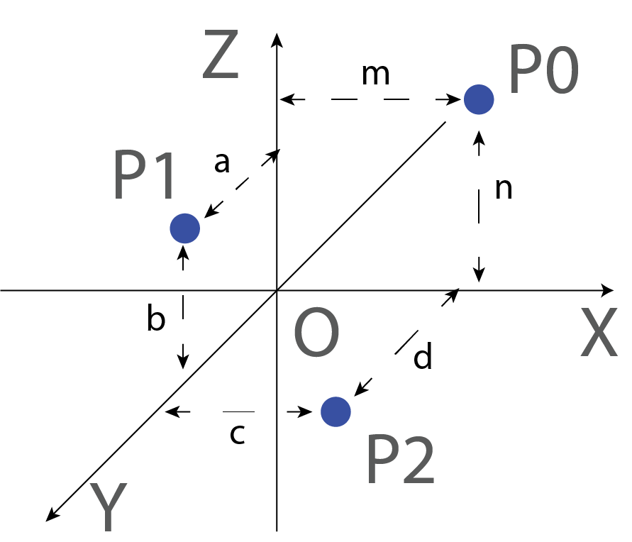
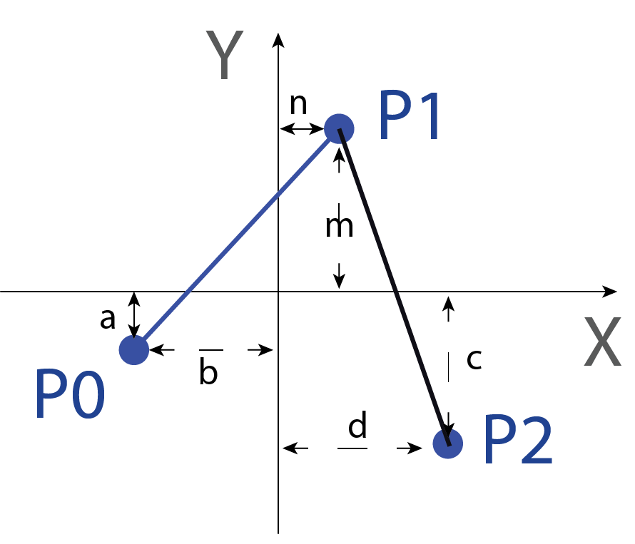

In this lab, we will work cover information and exercises related to basic coordination systems. 

## Part 1: Coordination Plane Exercise [In-lab] 
### 1.1 Cartesian coordinate system 
In graphics, we will work a lot with [Cartesian coordinate systems.](https://en.wikipedia.org/wiki/Cartesian_coordinate_system) Each point within the coordinate system can be represented by a group of numerical values. 


The coordinate of P can be represented as 
```
{"x":50,"y":50}
```
or, simply 
```
(50,50)

# by convention, the order of the coordinate is alphabetically sorted. e.g., if you have X and Y axis, you write the X-axis value before the Y-axis value. 

```
In programming, we often use variables to hold numerical values and expressions. For example, 
```
m=50
n=2*25

#coordinate of point P
P=(m,n)

```

The direction and orientation of the axis is subject to change. When specifying coordinates, it's always important to check the axis labels and the origin. Coordinates could have negative values.  



```
1.11 TODO: Write the coordinate for point P and point Q. 

P=(     ,      )
Q=(     ,      )
```


```
1.11 TODO: Write the coordinate for point P and point Q. 

P=( n, -m ) # direction of Y is reversed. n and m value is different from the previous annotation 
Q=(  -0.75*n   , m )
```



The coordinate system also works in 3D. Always check the direction, origin, and orientation of all axes. 



```
#TODO: In the diagram above, write down the coordinates for P0, P1, and P2


P0=(m,0,n )
P1=(    ,      ,      )
P2=(    ,      ,      )
```




```
#TODO: In the diagram above, write down the coordinates for P0, P1, and P2


P0=(m,0,n )
P1=(0,a,b )
P2=(c,d,0)

```



### 1.2 Working with lines and paths 

In this course, we will 
- call the graphical elements that contains exactly two points as **`lines`**.
- call the graphical elements that contains equal or more than two points as `paths` 




```
#TODO: according to the diagram above, write down the coordinates for LINE that contains P0-P1 and the PATH that contains P0 P1 and P2

line_p0p1=((),())
path_p0p1p2=((),(),())
```

Alternatively, you can specify the coordinates for each point first, then group them together to make lines and paths 

```
#TODO: according t the diagram above, write down the coordinates for LINE that contains P0-P1 and the PATH that contains P0 P1 and P2

p0=(,)
p1=(,)
p2=(,)

line_p0p1=(p0,p1)
path_p0p1p2=(p0,p1,p2)

```


```
#TODO: In the diagram above, write down the coordinates for LINE that contains P0-P1 and the PATH that contains P0 P1 and P2

line_p0p1=((-a,-b),(n,m))
path_p0p1p2=((-a,-b),(n,m),(d,-c))

OR 

p0=(-a,-b)
p1=(n,m)
p2=(d,-c)

line_p0p1=(p0,p1)
path_p0p1p2=(p0,p1,p2)

```



## Part 2: Grid System 