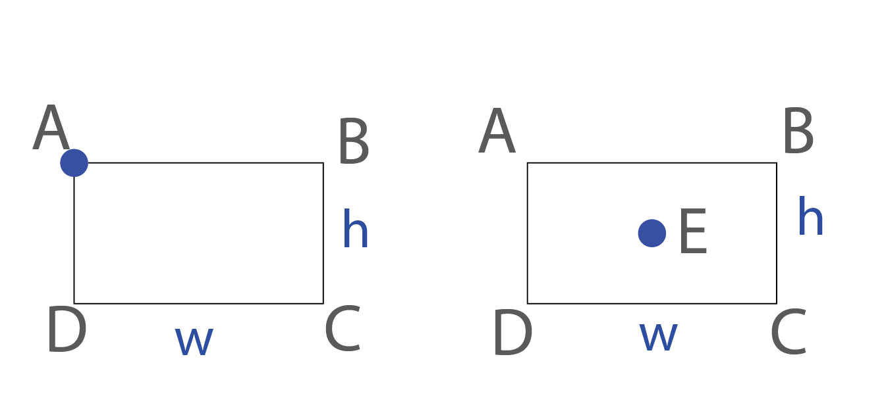
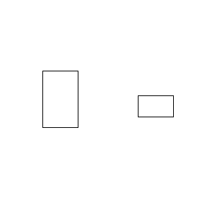
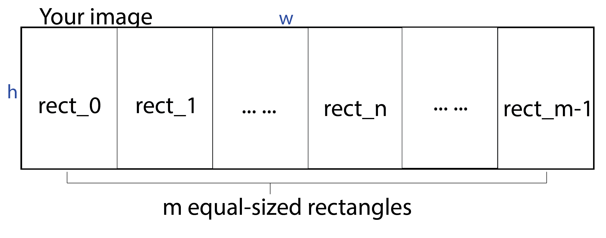
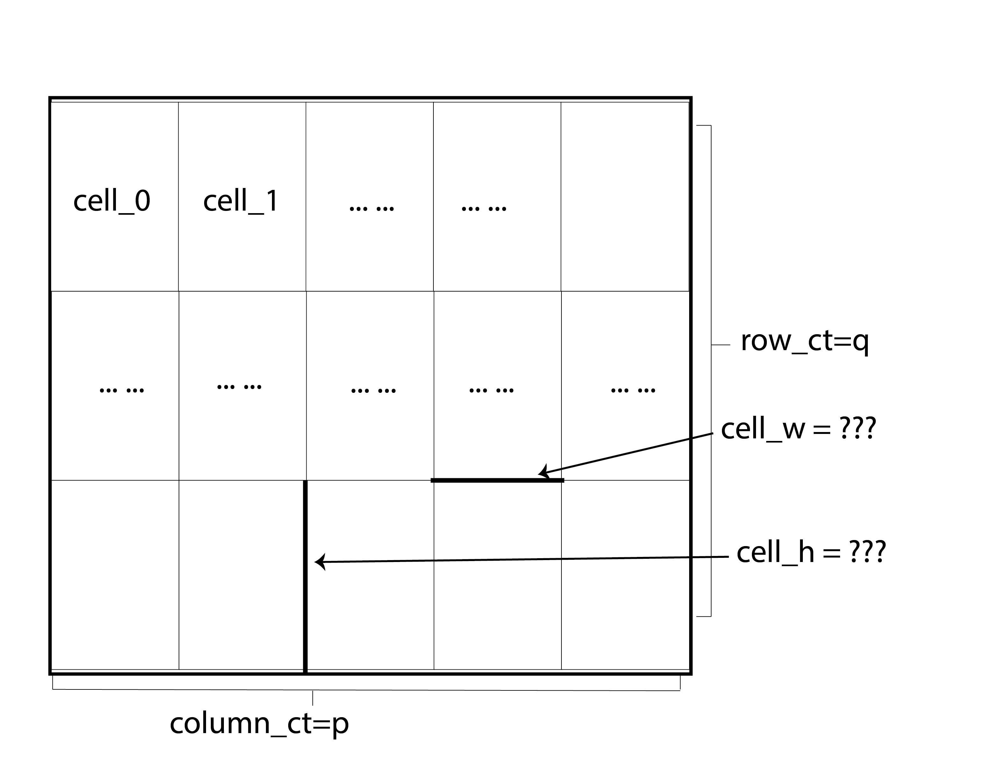
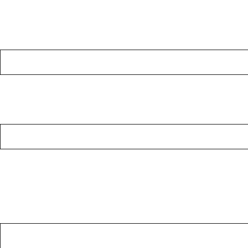
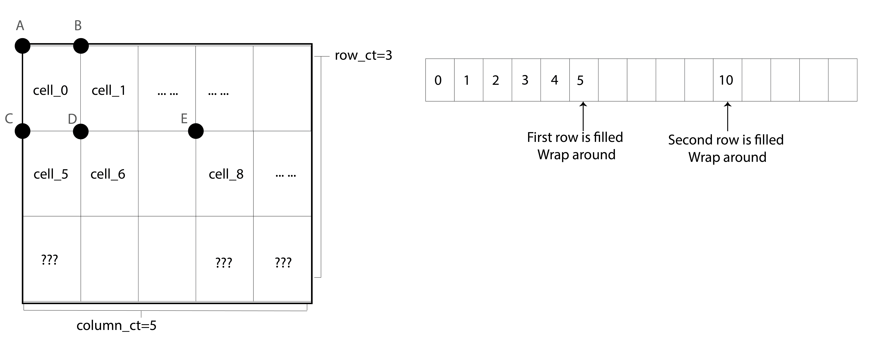

## Part 1: Coordination Plane Exercise [LAB, 3%] 
### Task 1.1 Two Functions for Creating Rectangles 
Rectangles are foundational graphical elements that we will play with frequently in this class. There are two common ways to specify a rectangle: 
{: width="500"}

In the first approach, users provide the coordinate for the top left of the rectangle (point A), along width and height. i.e., 


```
def draw_rect_from_top_left(top_left,width,height,img_draw):
    ##todo: calculate the coordinates of each corners of the rectangle 
    ##todo: draw the rectangle with the given img_draw 
```

The second approach calculates coordinates of the rectangle with the center of the rectangle (point E). 

```
def draw_rect_from_center(center,width,height,img_draw):
    ##todo: calculate the coordinates of each corners of the rectangle 
    ##todo: draw the rectangle with the given img_draw 
```

Implement these two functions. Before you start coding, write down the formula for calculating the coordinates of each corner. e.g., in approach one, given A, w, and h, pointB equals to ? pointC equals to? In approach 2, given E, point A equals to? point B equals to? 

NOTE 0: Make sure you review the coordinate system for PILLOW. Which direction is the positive X-axis? Which direction is the positive Y-axis? Where's the origin? How do they impact the coordinates for my rectangles? 

NOTE 1: in your implementation, you can choose to have 5 points in your rectangle (i.e., rect=[A,B,C,D,A] so that you always have a closed rectangle if you use the img_draw.line() method). If you have 4 points in your rectangle (rect=[A,B,C,D]), that's also correct. 


After writing down the formula, start a python script called `HW2_part1.py`. You can use the following template to write/test your functions. 

```
from PIL import Image,ImageDraw    
    
def draw_rect_from_top_left(top_left,width,height,img_draw):
    ##todo: calculate the coordinates of each corners of the rectangle 
    ##todo: draw the rectangle with the given img_draw 
    
    
def draw_rect_from_center(center,width,height,img_draw):
    ##todo: calculate the coordinates of each corners of the rectangle 
    ##todo: draw the rectangle with the given img_draw 
    
    
width=300
height=300
size=(width,height)    
    
img_1_1 = Image.new("L", size, 255)
draw_1_1=ImageDraw.Draw(img_1_1) 

###test your functions here 
#draw_rect_from_top_left((60,100),50,80,draw_1_1)
#draw_rect_from_center((220,150),50,30,draw_1_1)
```
The test case above will produce a result similar to:

{: width="500"}

You can play with different canvas size, starting locations, width, and height. 

### Task 1.2 Creating rectangles in a Row 
Often times the size of the rectangle we want to use is determined by the canvas size. 
e.g., given a canvas with the size of `w` and `h`, we want to be able to fit in `m` equal-sized rectangles in a row. The count of rectangle is stored in the variable `m`. 
{: width="700"}

First, we need to figure out the width and height of each rectangle. Implement the following function
```
#TODO 
def calcualte_rect_size_in_row(canvas_w,canvas_h,rect_ct):
    '''
    todo calculate the width and height of each rectangle 
    return it 
    e.g., return width, height
    '''
   
```

Then implement a function that would draw a rectangle in a row, given the index of the rectangle. 
```
#TODO 
def draw_nth_rectangle_in_a_row(n,canvas_w,canvas_h,rect_ct,):
    #todo calculate the width and height of each rectangle 
    #return it 
    # e.g., return width, height

```

After implementing these two functions, test your function with the following code: 
```
size_1_2=(500,100)
img_1_2=Image.new("L", size_1_2, 255)
draw_1_2 = ImageDraw.Draw(img_1_2)
draw_nth_rectangle_in_a_row(2,size_1_2[0],size_1_2[1],10,draw_1_2)
draw_nth_rectangle_in_a_row(5,size_1_2[0],size_1_2[1],10,draw_1_2)
draw_nth_rectangle_in_a_row(9,size_1_2[0],size_1_2[1],10,draw_1_2)
```
If everything works correctly, you should see an image similar to this: 

{: width="700"}


### Task 1.3 Creating rectangles in a column 
Similarly, given a canvas with the size of `w` and `h`, we want to be able to fit in `m` equal-sized rectangles in a **Column**.

{: width="700"}

Implement the following functions:
```
def calcualte_rect_size_in_column(canvas_w,canvas_h,rect_ct):
    '''
    todo calculate the width and height of each rectangle
    return it
    e.g., return width, height
    '''
    
def draw_nth_rectangle_in_a_column(n,canvas_w,canvas_h,rect_ct,img_draw):
    '''
    todo: draw the nth rectangle in the column
    :param canvas_w, canvas_h: width and height of the cavnas
    :param rect_ct: the number of rectangles to be fit in a column
    :param img_draw: an img_draw object used for drawing the rectangle
    '''
```
Test your implementation with the following block of code. 

```
size_1_3=(500,500)
img_1_3=Image.new("L", size_1_3, 255)
draw_1_3 = ImageDraw.Draw(img_1_3)
draw_nth_rectangle_in_a_column(2,size_1_3[0],size_1_3[1],10,draw_1_3)
draw_nth_rectangle_in_a_column(5,size_1_3[0],size_1_3[1],10,draw_1_3)
draw_nth_rectangle_in_a_column(9,size_1_3[0],size_1_3[1],10,draw_1_3)
```
{: width="700"}

### Task 1.4 Creating a rectangle in a grid. 
Now let's create a grid. 
Given a canvas with the `canvas_size=(canvas_w, canvas_h)`, we want to create a grid with `p` columns and `q` rows, what's the width and height of a cell within the grid?   

{: width="700"}

{: width="700"}


## Part 2: Creating grayscale images with Pillow (7.5%)

Create a new python script called `hw2_part2.py`. Open this [LINK TO ANSWER SHEET](), make a copy ( File-> Make a copy). For the following tasks, complete the task and paste your output/screenshot of code to the answer sheet. 

### Task 2.1 Creating rectangles in a row with margins 
### Task 2.2 Replicate the following design 
### Task 2.3 Sketch
### Task 2.4 Making two designs 
### Task 2.5 Inserting designs in a specific location
### Task 2.6 (BONUS): Creating designs with relative sizes 

Fill in the answer sheet. 

-------------END OF PART 2---------------------

## Submission Instruction 


Upload the following files to canvas (without compressing/zipping them)


1.hw1_part2.py

2.hw1_answersheet.pdf (you can use File->download-> as PDF to export the pdf version)


